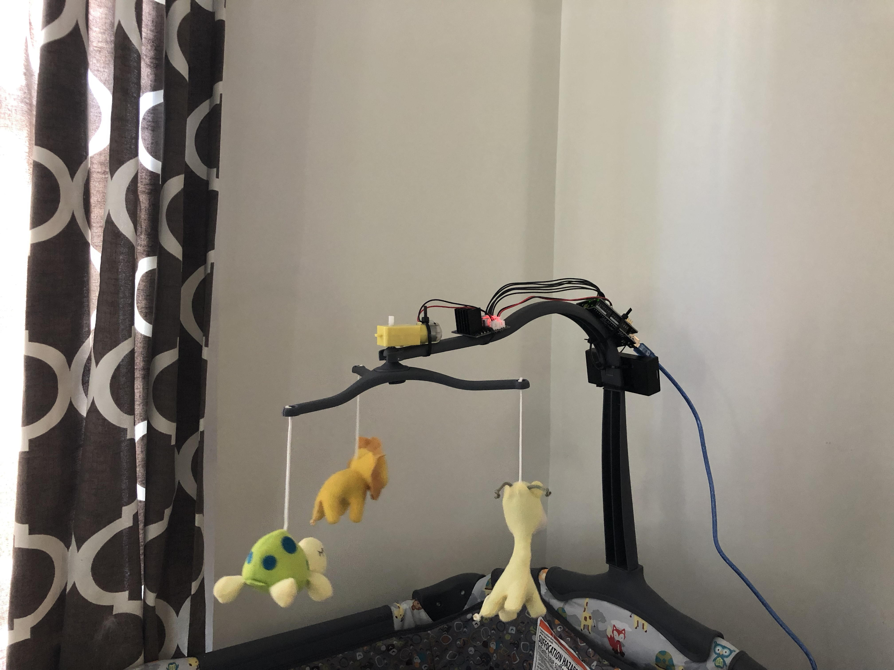

# Lunch Project: Baby Mobile

With the birth of our 2nd daughter came an unexpected love for mobiles. We hadn't planned for that, as our first child hated them... We simply installed the hanging version that came with the playpen and ignored it... Until we found out at 6 weeks that she just loved them... After a week of manually spinning it (with the assistance of a pool noodle so we could do other things/be more comfortable) we were tired of it. Over a spare lunch break or two, I repurposed an Arduino UNO RC Car kit ([Elegoo UNO Project Smart Robot Car Kit V 3.0 with UNO R3](https://www.elegoo.com/product/arduinocarv3-0/)) To do the job.

This repository contains the source code to build one yourselves... The tech specs for the equipment/parts used by the kit are available from the [kit's manual](https://www.elegoo.com/tutorial/Elegoo%20Smart%20Robot%20Car%20Kit%20V3.0.2019.05.27.zip) (if the link doesnt work, you can find it [here](https://www.elegoo.com/download/) manually).

